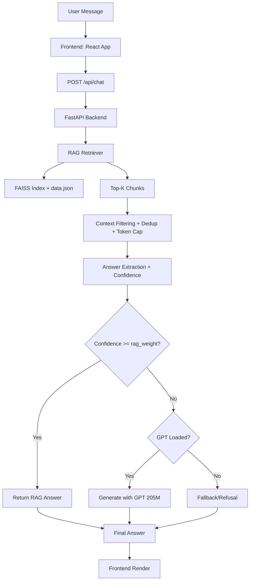
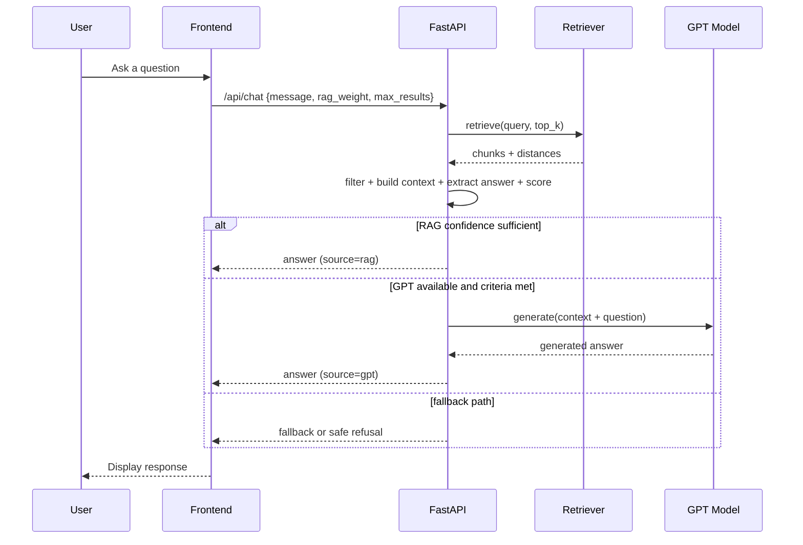
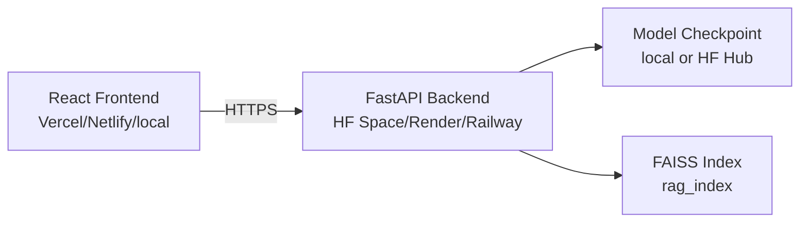

https://github.com/user-attachments/assets/39fe9a0e-3f25-41e0-b959-38989355f988


# EverydayGPT
[](https://arxiv.org/abs/2606.11212)

**Paper:** https://arxiv.org/abs/2606.11212

**Model:** https://huggingface.co/merciless-admiral/EverydayGPT-205M

**Demo/API:** https://huggingface.co/spaces/merciless-admiral/rag-gpt-backend

**Author:** Jaspreet Singh Nahal

## EverydayGPT: Confidence-Gated Routing for Efficient and Safe Hybrid GPT-RAG Conversational QA

This repository contains the official implementation of EverydayGPT, a hybrid GPT-RAG conversational QA system introducing Confidence-Gated Routing (CGR) for efficient and safe retrieval-augmented generation.

EverydayGPT is a full-stack, retrieval-augmented chatbot project built around a custom GPT model and a FAISS-backed knowledge retriever.

The project combines:
- a FastAPI backend for chat inference,
- a React frontend for conversational UX,
- a RAG pipeline for context grounding,
- and a custom GPT checkpoint with **205M parameters**.

## What This Project Does

- Answers user questions using retrieved context from a local/vector knowledge base.
- Uses confidence and distance-based gating to reduce hallucinations.
- Supports hybrid response selection (`RAG answer` first, `GPT generation` when needed).
- Exposes REST endpoints for chat and health checks.
- Provides deployment support for Hugging Face Spaces (Docker) and generic cloud hosts.

## High-Level Architecture



## Inference Decision Flow



## Repository Layout

```text
EverydayGPT/
|- README.md
|- backend/
|  |- api.py                 # FastAPI app, chat + health endpoints
|  |- chat.py                # CLI/local interactive chat entrypoint
|  |- train.py               # GPT architecture definition
|  |- gradio_app.py          # Gradio demo app
|  |- requirements.txt
|  |- Dockerfile
|  |- DEPLOYMENT.md
|  |- HF_SPACE_SETUP.md
|  |- upload_model.py
|  |- rag/
|  |  |- rag_retriever.py    # SentenceTransformer + FAISS retrieval
|  |  |- build_rag_index.py  # Build FAISS index from text corpus
|  |  |- config.py           # Retrieval/gating parameters
|  |  |- advanced_chunker.py # Chunking and dedup helpers
|  |- rag_index/
|     |- index.faiss
|     |- data.json
|- frontend/
	 |- package.json
	 |- src/
			|- App.js              # Chat UI + API integration
			|- App.css             # Styling and animations
```

## Core Components

### 1) Backend API (`backend/api.py`)
- Framework: FastAPI + CORS middleware.
- Main endpoints:
	- `POST /api/chat`
	- `GET /api/health`
- Loads local model checkpoint (or downloads from Hugging Face if configured).
- Runs RAG retrieval and answer-selection logic.

### 2) GPT Model (`backend/train.py`)
- Transformer-style causal language model implementation.
- Uses `GPTConfig` + stacked attention/MLP blocks.
- Project model target: **205M parameters**.

### 3) Retriever (`backend/rag/rag_retriever.py`)
- Embeddings via `sentence-transformers` (`all-MiniLM-L6-v2`).
- Vector search via FAISS index.
- Re-ranking applied before returning top chunks.

### 4) Frontend (`frontend/src/App.js`)
- React chat client with animated UX and suggestion prompts.
- Calls backend `/api/chat` endpoint using Axios.
- Performs health check on `/api/health`.

## Data and RAG Index

The backend expects an index directory at:
- `backend/rag_index/index.faiss`
- `backend/rag_index/data.json`

To rebuild index from text files under `backend/rag_data/`:

```bash
cd backend
python rag/build_rag_index.py
```

## Local Development

### Prerequisites
- Python 3.10+
- Node.js 18+
- npm

### 1) Run Backend

```bash
cd backend
pip install -r requirements.txt
uvicorn api:app --host 0.0.0.0 --port 7860 --reload
```

Backend base URL (local):
- `http://localhost:7860`

### 2) Run Frontend

```bash
cd frontend
npm install
npm start
```

Frontend default local URL:
- `http://localhost:3000`

If needed, set API URL before starting frontend:

```bash
# Linux/macOS
export REACT_APP_API_URL=http://localhost:7860

# Windows PowerShell
$env:REACT_APP_API_URL="http://localhost:7860"
```

## Environment Variables (Backend)

| Variable | Required | Description |
|---|---|---|
| `ALLOWED_ORIGINS` | Yes | Comma-separated frontend origins for CORS |
| `MODEL_PATH` | No | Local model checkpoint path (default: `model_domain_tuned_new.pt`) |
| `HF_MODEL_REPO_ID` | Conditional | HF model repo id for remote download |
| `HF_MODEL_FILENAME` | Conditional | Checkpoint filename in HF repo |
| `HF_MODEL_REVISION` | No | Branch/tag/commit in HF repo |
| `HF_TOKEN` / `HUGGINGFACE_HUB_TOKEN` | Conditional | Needed if HF repo is private |

## API Reference

### `POST /api/chat`
Request body:

```json
{
	"message": "How do fish breathe?",
	"rag_weight": 0.7,
	"max_results": 3
}
```

Response shape:

```json
{
	"answer": "...",
	"confidence": 0.82,
	"source": "rag",
	"response_time": 0.14,
	"retrieved_facts": [
		{"text": "...", "distance": 0.93}
	]
}
```

### `GET /api/health`
Returns service status, model load state, and retriever fact count.

## Deployment Topology



Deployment helpers already present:
- `backend/Dockerfile`
- `backend/Procfile`
- `backend/DEPLOYMENT.md`
- `backend/HF_SPACE_SETUP.md`

## Notes for Contributors

- Keep retrieval and generation behavior aligned with the current API contract.
- If you change RAG thresholds/config, update docs and test with both in-domain and out-of-domain prompts.
- If model artifacts or parameter count metadata changes, update this README and health reporting together.
